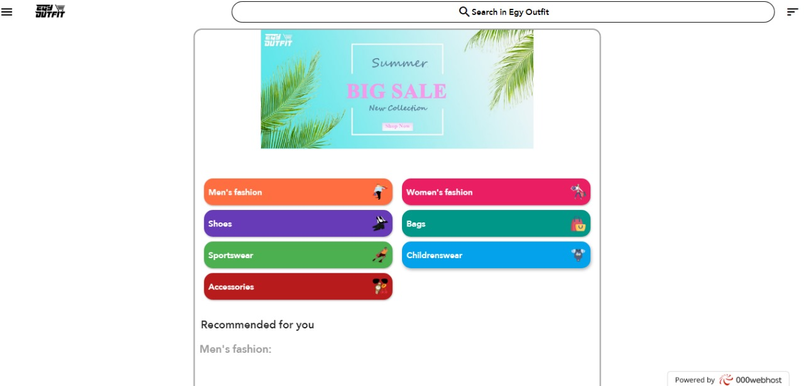
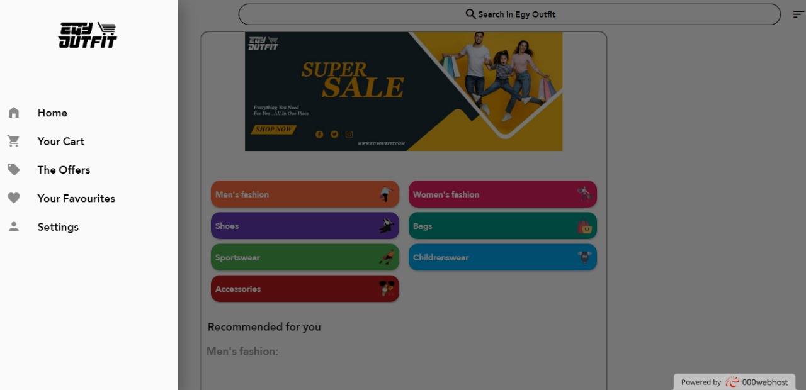
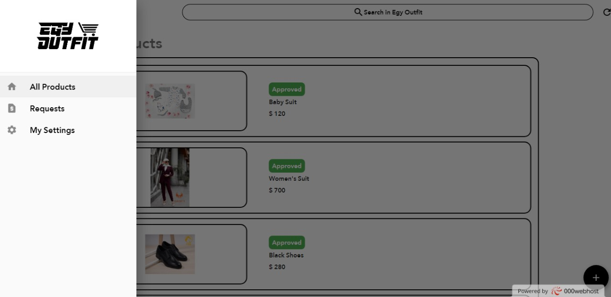

# egyoutfitweb

egy outfit web

## Getting Started

This project is a starting point for a Flutter application.

A few resources to get you started if this is your first Flutter project:

- [Lab: Write your first Flutter app](https://flutter.dev/docs/get-started/codelab)
- [Cookbook: Useful Flutter samples](https://flutter.dev/docs/cookbook)

For help getting started with Flutter, view our
[online documentation](https://flutter.dev/docs), which offers tutorials,
samples, guidance on mobile development, and a full API reference.
# Egyoutfit Web

Developed 'EgyOutfit,' a dynamic e-commerce multi-vendor application for both
Android and iOS platforms, complemented by a robust admin panel for centralized
control. The app empowers clothing stores to showcase and manage their products
while providing a seamless experience for buyers.
EgyOutfit delivers a tailored shopping experience, connecting buyers with a diverse
array of clothing vendors. The app's powerful admin panel ensures efficient
management and control over the entire e-commerce ecosystem, fostering a
thriving marketplace for commercial clothes.

Star ⭐ the repo if you like what you see😉.

#### How to Install?
```
git clone https://github.com/omarabdullah1/egyoutfitweb.git
cd egyoutfitweb
flutter packages get
flutter run -d chrome
```
#### Looks
<table>
  <tr>
      <td></td>
      <td></td>
      <td></td>
  </tr>
</table>